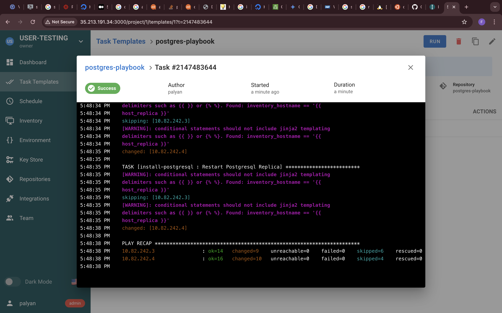
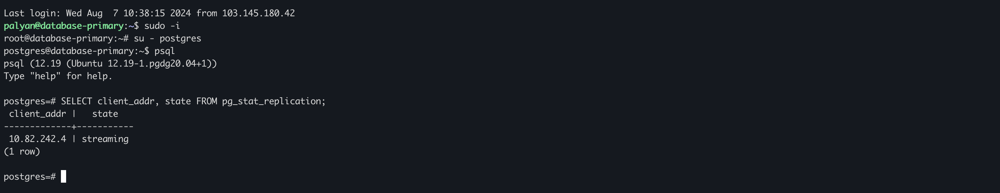
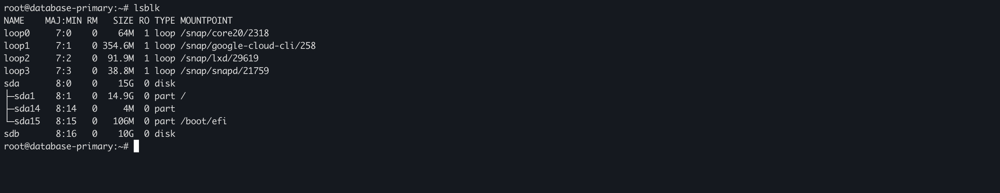
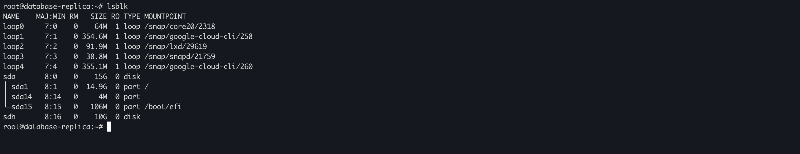
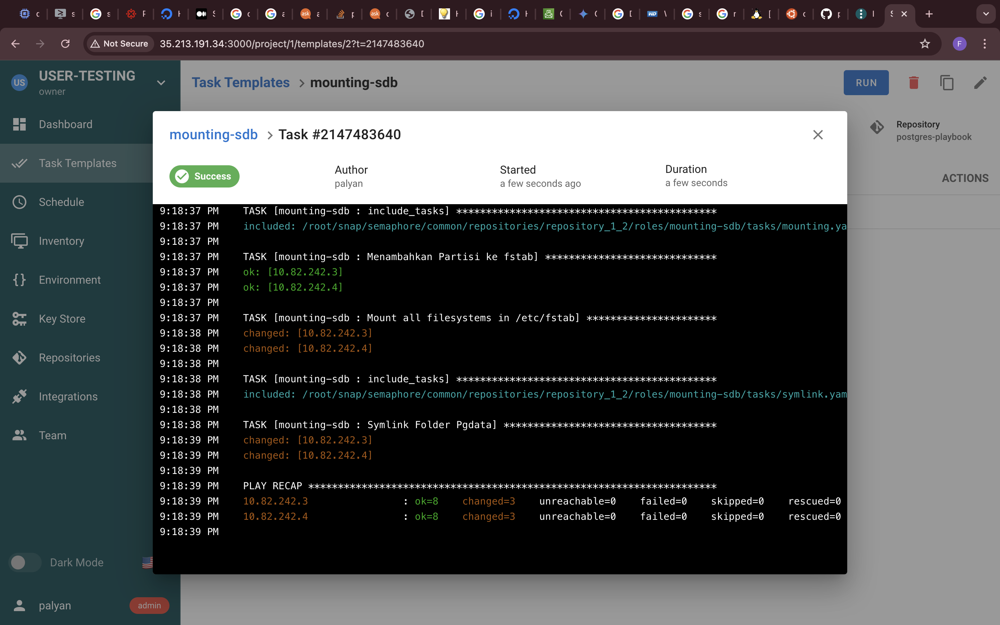

# Lampiran
```
  This task using Semaphore Ansible https://docs.semaphoreui.com/, installing on google cloud compute engine with Ubuntu 20.04 LTS
```
## Postresql replica



## sdb storage





 
