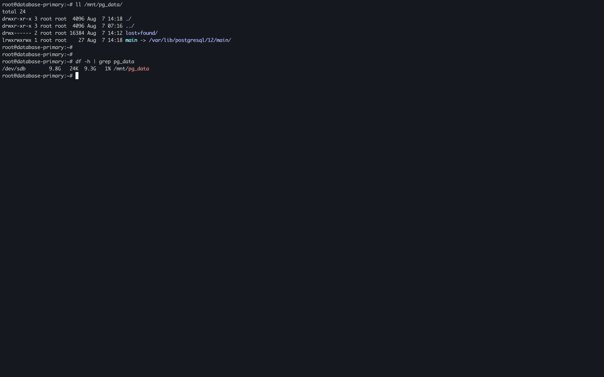

# Lampiran
  This task using Semaphore Ansible https://docs.semaphoreui.com/, installing on google cloud compute engine with Ubuntu 20.04 LTS
## playbook postresql replica (task number 1.a)

## sdb storage pgdata (task number 1.b)

## playbook mounting sdb 

## playbook node metric (task number 1.c)

## palybook postgres metric (task number 1.c)

## playbook pgBadger (task number 1.d)

## ALL PLAYBOOK SUCCEDED

# task number 2

pada gambar diatas terdapat infrastruktur aplikasi yang mana terdapat tiga buah app server yang berjalan secara paralel dengan satu tujuan database server, berikut review yang saya lakukan terhadap infrastruktur aplikasi diatas.
1. jika dilihat dari load balancer perlu ditambahkan firewall sebagai bentuk security.
2. dilihat dari app server yang berjalan jika memiliki banyak service sebaik nya aplikasi dikemas dalam bentuk containerized atau microservice dan dijalankan diatas teknologi orkestrasi seperti docker swarm, kubernetes, dan openshift.
3. terlihat juga dari database server yang belum memiliki infrastruktur HA (High Availability), jika jumlah user atau load tinggi sebaiknya disediakan database terdistribusi atau replikasi.
4. aplikasi yang berjalan membutuhkan monitoring dari infrastruktur diatas belum menunjukan bagian monitoring yang mana ini bagian terpenting buat logging agar memudahkan administrator untuk melakukan tracing error pada sistem.

 
